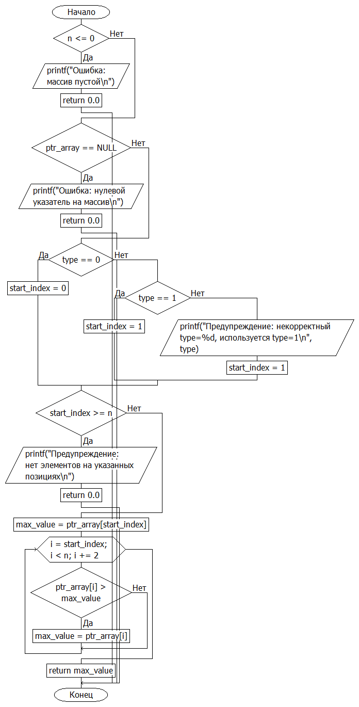
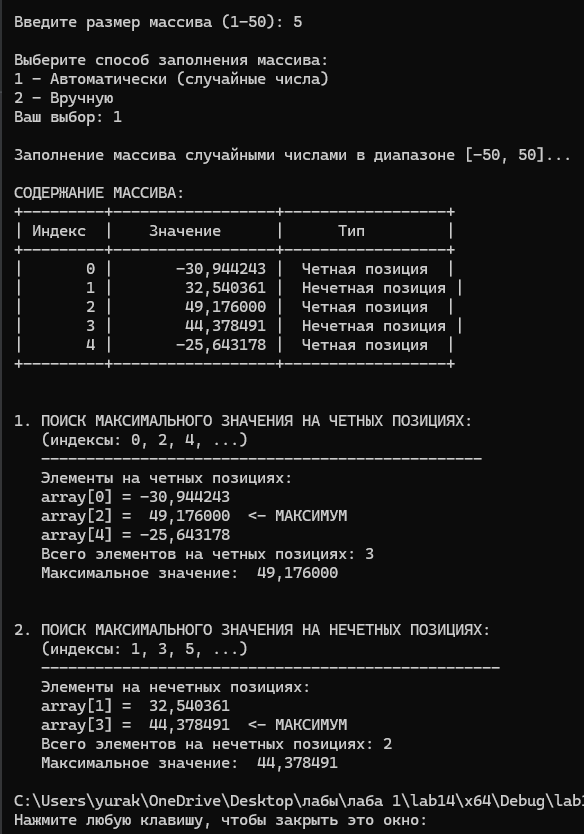

# Домашняя работа к лабораторной работе 14.
## Условия задачи:
Определение максимального значения элемента находящегося на четных/нечетных
позициях (определяется параметром функции int type).

## 1. Алгоритм и блок схема:
### Алгоритм:
1. **Начало**
2. Объявить переменные:
  - `N` = 50
  - `array[N]`
  - `size`
  - `choice`
3.  Проверка условия `size` < 1 || `size` > `N`:
   - Вывод: "Ошибка: размер должен быть от 1 до %d\n", N"
4. Ввод:
  - `choice`
5. Проверка условия `choice` == 1:
  - Да
    - srand(`time`(NULL))
    - Цикл от 0 до `size`:
      - `array[i]` = -50.0 + 100.0 * (rand() / (double)`RAND_MAX`)
  - Иначе
    - Цикл от 0 до `size`:
      - Ввод: `array[i]`
5. Цикл от 0 до `size`:
   - Проверка условия  `i` % 2 == 0:
     - Да
           - Вывод: Четная позиция"
     - Иначе
           - Вывод: Нечетная позиция
6. Вывести результаты расчётов с подстановкой значений в текст.
7. **Конец**

### Блок схема

## 2. Реализация программы:
```
#define _CRT_SECURE_NO_DEPRECATE
#include <locale.h>
#include <stdio.h>
#include <stdlib.h>
#include <time.h>
#include <math.h>

#define N 50

double find_max_on_positions(double* ptr_array, int n, int type);

int main() {
    setlocale(LC_ALL, "");
    double array[N];
    int size;

    printf("Введите размер массива (1-%d): ", N);
    scanf("%d", &size);

    if (size < 1 || size > N) {
        printf("Ошибка: размер должен быть от 1 до %d\n", N);
        return 1;
    }

    printf("\nВыберите способ заполнения массива:\n");
    printf("1 - Автоматически (случайные числа)\n");
    printf("2 - Вручную\n");
    printf("Ваш выбор: ");

    int choice;
    scanf("%d", &choice);

    if (choice == 1) {
        srand(time(NULL));
        printf("\nЗаполнение массива случайными числами в диапазоне [-50, 50]...\n");

        for (int i = 0; i < size; i++) {
            array[i] = -50.0 + 100.0 * (rand() / (double)RAND_MAX);
        }
    }
    else {
        printf("\nВведите %d элементов массива:\n", size);
        for (int i = 0; i < size; i++) {
            printf("array[%d] = ", i);
            scanf("%lf", &array[i]);
        }
    }

    printf("\nСОДЕРЖАНИЕ МАССИВА:\n");
    printf("+---------+------------------+------------------+\n");
    printf("| Индекс  |    Значение      |      Тип         |\n");
    printf("+---------+------------------+------------------+\n");

    for (int i = 0; i < size; i++) {
        printf("| %7d | %16.6f |", i, array[i]);

        if (i % 2 == 0) {
            printf("  Четная позиция  |\n");
        }
        else {
            printf("  Нечетная позиция |\n");
        }
    }
    printf("+---------+------------------+------------------+\n");

    printf("\n\n1. ПОИСК МАКСИМАЛЬНОГО ЗНАЧЕНИЯ НА ЧЕТНЫХ ПОЗИЦИЯХ:\n");
    printf("   (индексы: 0, 2, 4, ...)\n");
    printf("   -------------------------------------------------\n");

    double max_even = find_max_on_positions(array, size, 0);

    printf("   Элементы на четных позициях:\n");
    int even_count = 0;
    for (int i = 0; i < size; i += 2) {
        printf("   array[%d] = %10.6f", i, array[i]);
        if (fabs(array[i] - max_even) < 0.000001) {
            printf("  <- МАКСИМУМ");
        }
        printf("\n");
        even_count++;
    }
    printf("   Всего элементов на четных позициях: %d\n", even_count);
    printf("   Максимальное значение: %10.6f\n", max_even);

    printf("\n\n2. ПОИСК МАКСИМАЛЬНОГО ЗНАЧЕНИЯ НА НЕЧЕТНЫХ ПОЗИЦИЯХ:\n");
    printf("   (индексы: 1, 3, 5, ...)\n");
    printf("   ---------------------------------------------------\n");

    double max_odd = find_max_on_positions(array, size, 1);

    printf("   Элементы на нечетных позициях:\n");
    int odd_count = 0;
    for (int i = 1; i < size; i += 2) {
        printf("   array[%d] = %10.6f", i, array[i]);
        if (fabs(array[i] - max_odd) < 0.000001) {
            printf("  <- МАКСИМУМ");
        }
        printf("\n");
        odd_count++;
    }
    printf("   Всего элементов на нечетных позициях: %d\n", odd_count);
    printf("   Максимальное значение: %10.6f\n", max_odd);

    return 0;
}

double find_max_on_positions(double* ptr_array, int n, int type) {

    if (n <= 0) {
        printf("Ошибка: массив пустой\n");
        return 0.0;
    }

    if (ptr_array == NULL) {
        printf("Ошибка: нулевой указатель на массив\n");
        return 0.0;
    }

    int start_index;

    if (type == 0) {

        start_index = 0;
    }
    else if (type == 1) {

        start_index = 1;
    }
    else {

        printf("Предупреждение: некорректный type=%d, используется type=1\n", type);
        start_index = 1;
    }

    if (start_index >= n) {
        printf("Предупреждение: нет элементов на указанных позициях\n");
        return 0.0;
    }
    double max_value = ptr_array[start_index];

    for (int i = start_index; i < n; i += 2) {
        if (ptr_array[i] > max_value) {
            max_value = ptr_array[i];
        }
    }

    return max_value;
}
```
## 3. Результат работы программы

## 4. Информация о разработчике
Капичников Юрий, бИПТ-252
